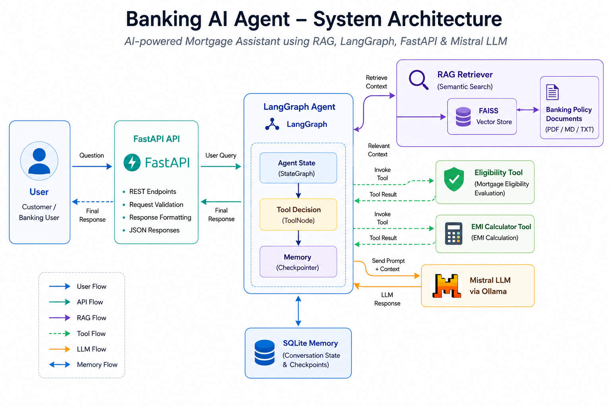
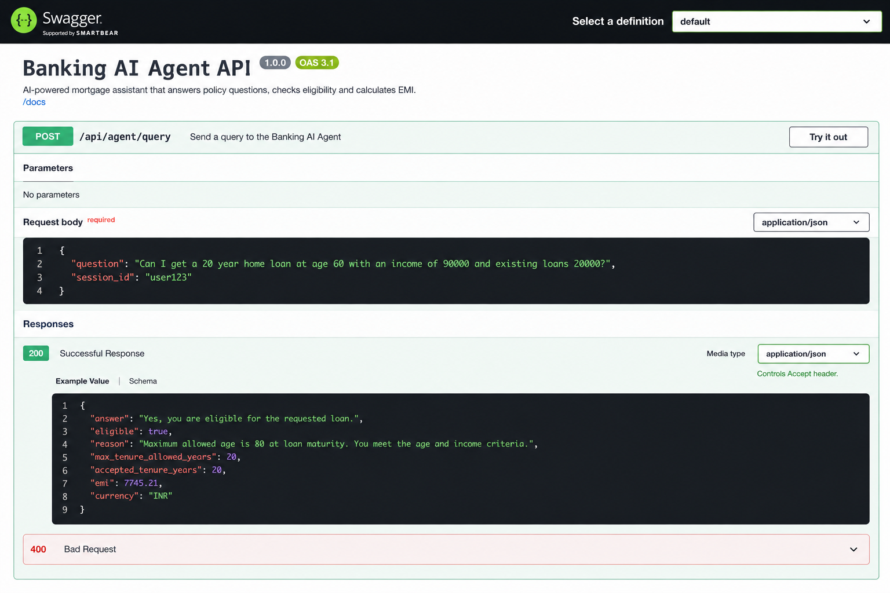

Replace your entire `README.md` with the below content.

This version is written specifically for your **Banking AI Agent project**, optimized for GitHub recruiters and AI Engineer interviews.

```markdown
# 🏦 Banking AI Agent - Mortgage Assistant


An AI-powered mortgage banking assistant built using **Retrieval Augmented Generation (RAG), LangGraph agents, FastAPI, and LLM tool calling**.

The system provides policy-grounded responses for mortgage queries, performs loan eligibility assessment, and calculates EMI using custom AI tools.

---

# 📌 Project Overview

Traditional banking support systems require manual policy searching and rule checking.

This project demonstrates an AI agent capable of:

- Understanding customer mortgage queries
- Retrieving relevant banking policies using RAG
- Reasoning through LangGraph workflows
- Calling specialized tools
- Providing structured banking responses

The assistant acts as a mortgage banking support agent.

---

# 🚀 Key Features

## 🤖 AI Agent Workflow

Implemented using **LangGraph** with:

- State-based agent architecture
- Tool execution workflow
- Memory persistence
- Multi-step reasoning

---

## 🔎 Retrieval Augmented Generation (RAG)

The system uses RAG to ground responses using mortgage policy documents.

Pipeline:

```

Policy Documents
|
↓
Document Loading
|
↓
Text Chunking
|
↓
Embeddings Generation
|
↓
FAISS Vector Database
|
↓
Similarity Retrieval
|
↓
LLM Context
|
↓
Final Response

```

Benefits:

- Reduces hallucination
- Provides policy-based answers
- Allows easy document updates

---

# 🧠 Agent Tools

## 1. Loan Eligibility Tool

Evaluates mortgage eligibility using:

```

Maturity Age = Customer Age + Requested Loan Tenure

```

Example:

```

Customer Age: 60
Loan Tenure: 20 years

Maturity Age:
60 + 20 = 80 years

Maximum Allowed:
75 years

Decision:
Not Eligible

```

---

## 2. EMI Calculator Tool

Calculates monthly EMI using:

- Loan amount
- Interest rate
- Loan tenure

Example:

```

Loan Amount: 500000
Interest Rate: 6%
Tenure: 20 years

Monthly EMI:
3582.16

```

---

# 🏗️ System Architecture




Architecture flow:

```

User Query
|
↓
FastAPI Backend
|
↓
LangGraph Agent
|
├── RAG Retriever
|
├── Eligibility Tool
|
└── EMI Calculator Tool
|
↓
Mistral LLM
|
↓
Structured Response

```

---

# 🛠️ Technology Stack

## Backend

- Python
- FastAPI
- Uvicorn

## AI Frameworks

- LangChain
- LangGraph
- Ollama
- Mistral LLM

## Retrieval

- FAISS Vector Database
- Sentence Transformers
- Embeddings

## Storage

- SQLite checkpoint memory

## Development

- Git
- GitHub
- Virtual Environment

---

# 📂 Project Structure

```

banking-ai-agent
│
├── app
│   │
│   ├── agents
│   │   ├── basic_agent.py
│   │   └── rag_agent.py
│   │
│   ├── api
│   │   ├── main.py
│   │   └── routes.py
│   │
│   ├── database
│   │   └── memory.py
│   │
│   ├── rag
│   │   ├── loader.py
│   │   ├── retriever.py
│   │   └── vector_store.py
│   │
│   └── tools
│       ├── eligibility_tool.py
│       └── emi_tool.py
│
├── assets
│   ├── architecture.png
│   └── swagger_response.png
│
├── documents
│   └── home_loan_policy.md
│
├── docs
│   └── interview_notes.md
│
├── tests
│
├── main.py
├── requirements.txt
└── .env.example

````

---

# ⚙️ Installation

## 1. Clone Repository

```bash
git clone https://github.com/nithinsp7-oss/banking-ai-agent.git

cd banking-ai-agent
````

---

## 2. Create Virtual Environment

Windows:

```bash
python -m venv venv

venv\Scripts\activate
```

Linux/Mac:

```bash
python3 -m venv venv

source venv/bin/activate
```

---

## 3. Install Dependencies

```bash
pip install -r requirements.txt
```

---

# 🤖 Running Local LLM

This project uses Ollama with Mistral.

Install Ollama:

[https://ollama.com/](https://ollama.com/)

Download model:

```bash
ollama pull mistral
```

Verify:

```bash
ollama list
```

---

# 🔐 Environment Configuration

Create:

```
.env
```

Example:

```
MODEL_NAME=mistral
VECTOR_DB_PATH=vectorstore
```

A template is available:

```
.env.example
```

---

# ▶️ Run Application

Start FastAPI:

```bash
uvicorn app.api.main:app --reload
```

Application runs at:

```
http://127.0.0.1:8000
```

---

# 📘 API Documentation

Swagger UI:

```
http://127.0.0.1:8000/docs
```

Example API response:



---

# 🧪 Testing

Run tests:

```bash
python tests/test_agent_tools.py
```

Example tests:

```
TEST 1 - Loan Eligibility Check

TEST 2 - EMI Calculation

TEST 3 - Combined Eligibility + EMI Agent
```

---

# 💡 Sample Queries

## Eligibility Query

```
Can I get a 20 year home loan?
My age is 60
```

Response:

```
Decision:
Not Eligible

Reason:
Maturity age is 80 years,
which exceeds maximum allowed age of 75 years.
```

---

## EMI Query

```
Calculate EMI.

Loan amount:
500000

Interest rate:
6%

Tenure:
20 years
```

Response:

```
Monthly EMI:
3582.16
```

---

# 🎯 Engineering Concepts Demonstrated

This project demonstrates:

✅ Retrieval Augmented Generation (RAG)

✅ Vector similarity search

✅ Embeddings

✅ LLM integration

✅ LangGraph agent workflows

✅ Tool calling

✅ Prompt engineering

✅ FastAPI backend development

✅ AI application architecture

✅ Memory persistence

---

# 🔮 Future Improvements

Possible production enhancements:

* Authentication and authorization
* Cloud deployment
* Docker containerization
* CI/CD pipeline
* Logging and monitoring
* Evaluation framework
* Multi-document knowledge base
* Better conversation memory
* Enterprise vector database integration

---

# 👨‍💻 Author

**Nithin SP**

AI Engineer | Generative AI | RAG | LangGraph | LLM Applications

GitHub:

[https://github.com/nithinsp7-oss](https://github.com/nithinsp7-oss)

---

# 📄 Interview Documentation

Detailed project explanation:

```
docs/interview_notes.md
```

Contains:

* Architecture explanation
* RAG design decisions
* LangGraph workflow
* Tool implementation
* Interview discussion points

````

---

After replacing README:

Run:

```powershell
git add README.md
git commit -m "Improve project README documentation"
git push
````

This README will make the repository look like a **real AI Engineer portfolio project**, not just a coding exercise.
 
